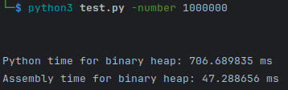

# Execution time differences of the same tasks, one implemented in Python and the other in Assembly x86_64
### Description
This repository contains the implementation of the same tasks in Python and Assembly x86_64. Tasks differ from each other, and will be updated from time to time as the repository grows. The main goal of this project is to make it more enjoyable for me to learn Assembly x86_64, by seeing the differences in execution times of the same tasks implemented in Python and Assembly x86_64.
Here are the tasks implemented so far:
1. Binary heap
2. ...

### 1 - Binary heap
#### Description
I'll compare whole performance of binary heap, all kind of operations like: add, or remove. The program will be given a file with testing data, and it will construct
a binary heap from it. Then, it will perform all kind of operations on it, and measure the execution time of programs. The _test.py_ script in BinaryHeap folder will manage all tests and print the results in the pretty way.
Btw. I implemented min heap versions.
#### Execution of _test.py_:

As we see implementation in Assembly is more than 14 times faster than this made in Python. But it's worth to mention that writing code in Assembly is much more time-consuming and error-prone than in Python. If you see any mistakes in my code, please let me know. I'm still learning Assembly, and I'm open to any suggestions.
